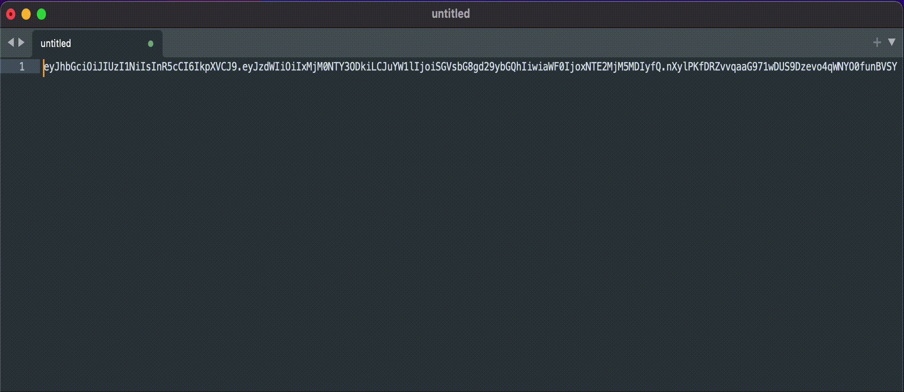
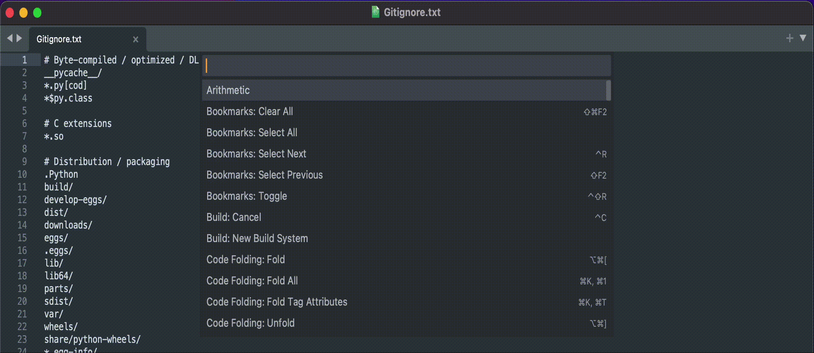

JWT Decode
=======

A simple plugin for decoding JWTs, like [jwt.io](http://jwt.io), in Sublime Text.

### Decode from selection:
Decode JWTs by selecting them and invoking the `JWT: Decode` command from the command palette.

### Decode from command palette:
Decode a JWT by invoking the `JWT: Decode` command, pasting the encoded token and hitting enter.
